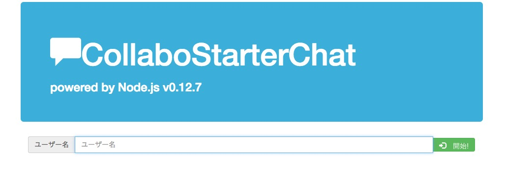
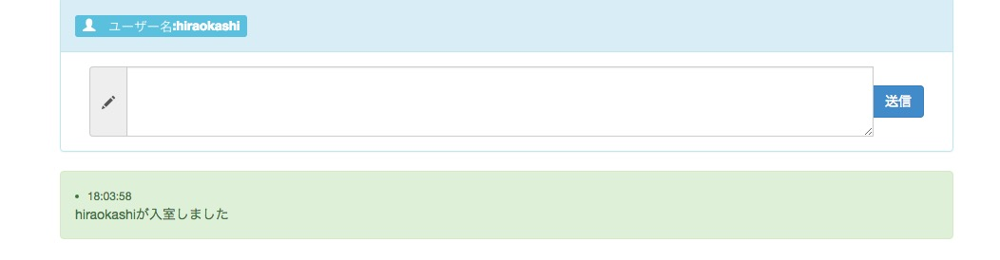

## 概要
 collabostarterプロジェクトで使用する簡易チャットアプリ
 Node.js v0.12.7 にて構築
 最初の接続時にユーザ名を入力してチャットできます。
 IPにひも付けてユーザ名を保存するので、再接続の際もユーザ名の再入力不要


 (https://www.facebook.com/collabostarter)





[herokuで公開中](https://collabostarterchat.herokuapp.com/)

## 参考ソース、アプリ
(https://github.com/hatena-iti/socketio-sample.git)
(http://qiita.com/hosomichi/items/66b309a6c3c20d910218)


## 使い方
```
git clone https://github.com/hiraokashi/collabostarterchat.git
cd collabostarterchat
node app.js
```
